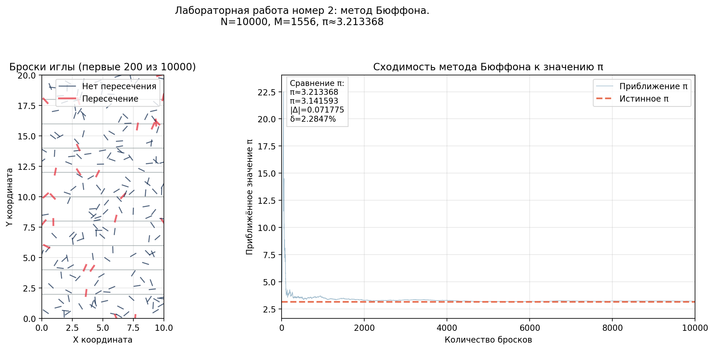

# 🧪 Lab 02: Buffon's Needle Method

[](https://www.python.org/)
[](https://numpy.org/)
[](https://matplotlib.org/)
[]()

Лабораторная работа №2 по дисциплине **«Математическое компьютерное моделирование»**.

---

## Описание задачи

Оценка числа π методом Бюффона (бросок иглы на лист с параллельными линиями):

$$ P = \frac{2l}{\pi a}, \; l \le a $$

$$ \pi \approx \frac{2 l N}{a M} $$

где:
- `l` — длина иглы
- `a` — расстояние между линиями
- `N` — число бросков
- `M` — число пересечений линий

---

## Пример результата



---

## Возможности

| Функция | Описание |
|---------|----------|
| Параметризация | Все настройки в `config.py` |
| Оценка π | Расчёт по формуле Бюффона |
| Оценка ошибок | Абсолютная и относительная погрешности |
| Визуализация | Броски иглы + сходимость |
| Экспорт графиков | PNG + SVG в папку `plots/` |

---

## Технологии

| Компонент | Версия | Назначение |
|-----------|--------|------------|
| Python | 3.9+ | Основной язык |
| NumPy | 2.0.2 | Генерация случайных точек |
| Matplotlib | 3.9.4 | Построение графиков |

---

## Запуск

# 1. Активировать виртуальное окружение (из корня проекта)
```
source .venv/bin/activate
```

# 2. Перейти в папку лабы
```
cd lab-02-buffon-needle
```

# 3. Запустить скрипт
```
python3 lab2.py
```

---

## После запуска:
1. Выведет число бросков, пересечений, оценку π и ошибки
2. Создаст папку `plots/` (если нет)
3. Сохранит графики с уникальным именем

---

## ⚙️ Конфигурация
Все параметры в `config.py`:

|Параметр|Описание|
|---|---|
|`L`|Длина иглы `l`|
|`A`|Расстояние между линиями `a`|
|`N`|Количество бросков `N`|
|`RANDOM_SEED`|Зерно генератора (None = случайно)|
|`BOARD_WIDTH`|Ширина области для визуализации|
|`Y_MIN`, `NUM_STRIPS`|Нижняя граница и число промежутков между линиями|
|`INCLUDE_BORDER`|Считать попадание на линию пересечением|
|`MAX_NEEDLES_SHOW`|Сколько игл показывать на первом графике|
|`CONVERGENCE_EVERY`|Шаг прореживания для графика сходимости|
|`SAVE_UNIQUE_NAMES`|Защита от перезаписи файлов|
|`SHOW_PLOT`|Показывать окно с графиком|

**Важно:** формула оценки π корректна при `L <= A`.

---

## Структура папки
```
lab-02/
├── config.py                 # Конфигурация задачи
├── lab2.py                   # Основной скрипт
├── README.md                 # Этот файл
├── examples/                 # Пример графика для README
│   └── variant-01.svg
└── plots/                    # Графики
```
<div align="center">

[⬆️ Наверх](#-Lab-02-Buffon-s-Needle-Method)

</div>
