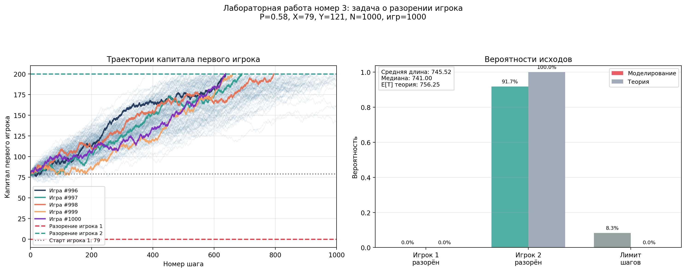

# 🎲 Lab 03: Gambler's Ruin Problem

[](https://www.python.org/)
[](https://numpy.org/)
[](https://matplotlib.org/)
[]()

Лабораторная работа №3 по дисциплине **«Математическое компьютерное моделирование»**.

---

## Описание задачи

Моделирование задачи о разорении игрока: два игрока имеют начальные капиталы `X` и `Y`, суммарный капитал

$$ T = X + Y $$

На каждом шаге первый игрок выигрывает 1 рубль с вероятностью `P` и проигрывает 1 рубль с вероятностью `1 - P`.

Игра заканчивается, если капитал первого игрока достигает одной из границ:

- `0` — первый игрок разорён
- `T` — второй игрок разорён
- `N` шагов — игра остановлена по лимиту

Для сравнения моделирования с теорией используется классическая формула вероятности поглощения. Если `q = 1 - P`, `r = q / P`, `P ≠ q`, то вероятность разорения первого игрока:

$$ P_0 = \frac{r^X - r^T}{1 - r^T} $$

При `P = q`:

$$ P_0 = \frac{T - X}{T} $$

---

## Пример результата



---

## Возможности

| Функция | Описание |
|---------|----------|
| Параметризация | Все настройки в `config.py` |
| Моделирование игр | Одновременное моделирование `N_GAMES` партий |
| Аналитическое сравнение | Теоретические вероятности разорения и средняя длительность |
| Визуализация | Траектории капитала + вероятности исходов |
| Экспорт графиков | PNG + SVG в папку `plots/` |

---

## Технологии

| Компонент | Версия | Назначение |
|-----------|--------|------------|
| Python | 3.9+ | Основной язык |
| NumPy | 2.0.2 | Генерация случайных исходов и расчёты |
| Matplotlib | 3.9.4 | Построение графиков |

---

## Запуск

# 1. Активировать виртуальное окружение (из корня проекта)
```
source .venv/bin/activate
```

# 2. Перейти в папку лабы
```
cd lab-03
```

# 3. Запустить скрипт
```
python3 lab3.py
```

---

## После запуска:
1. Выведет параметры эксперимента, вероятности исходов и среднюю длину игры
2. Создаст папку `plots/` (если нет)
3. Сохранит графики с уникальным именем

---

## Конфигурация
Все параметры в `config.py`:

|Параметр|Описание|
|---|---|
|`P`|Вероятность выигрыша 1 рубля первым игроком|
|`X`|Начальный капитал первого игрока|
|`Y`|Начальный капитал второго игрока|
|`N`|Максимальное число шагов в одной игре|
|`N_GAMES`|Количество моделируемых игр|
|`RANDOM_SEED`|Зерно генератора (None = случайно)|
|`BACKGROUND_TRAJECTORIES`|Сколько траекторий показывать фоном|
|`HIGHLIGHT_TRAJECTORIES`|Сколько последних траекторий выделять цветом|
|`SAVE_UNIQUE_NAMES`|Защита от перезаписи файлов|
|`SHOW_PLOT`|Показывать окно с графиком|

**Важно:** при малом `N` часть игр может завершиться по лимиту шагов. Теоретические вероятности в отчёте относятся к игре без ограничения по числу шагов.

---

## Структура папки
```
lab-03/
├── config.py                 # Конфигурация задачи
├── lab3.py                   # Основной скрипт
├── README.md                 # Этот файл
├── examples/                 # Для README
│   ├── example.png           # Пример графика
│   └── legacy/               # Ранние графики, перенесённые из корня
└── plots/                    # Графики
```
<div align="center">

[⬆️ Наверх](#-Lab-03-Gambler-s-Ruin-Problem)

</div>
