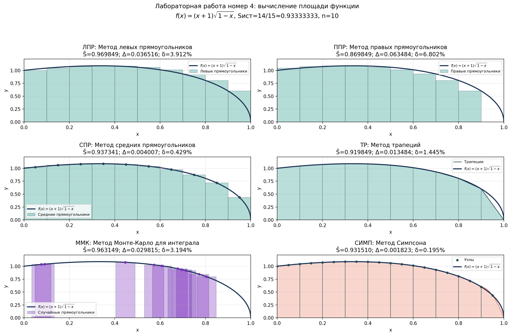

# 📐 Lab 04: Numerical Integration Methods

[](https://www.python.org/)
[](https://numpy.org/)
[](https://matplotlib.org/)
[]()

Лабораторная работа №4 по дисциплине **«Математическое компьютерное моделирование»**.

---

## Описание задачи

Вычислить площадь под графиком функции различными численными методами:

$$ f(x) = (x + 1)\sqrt{1 - x} $$

на отрезке:

$$ x \in [0; 1] $$

Истинное значение площади:

$$ S_{ист} = \int_0^1 (x + 1)\sqrt{1 - x}\,dx $$

Сделаем замену `u = 1 - x`:

$$ S_{ист} = \int_0^1 (2 - u)\sqrt{u}\,du = \frac{14}{15} \approx 0.9333333333 $$

---

## Пример результата



---

## Методы

| Обозначение | Метод |
|-------------|-------|
| ЛПР | Метод левых прямоугольников |
| ППР | Метод правых прямоугольников |
| СПР | Метод средних прямоугольников |
| ТР | Метод трапеций |
| ММК | Метод Монте-Карло для интеграла |
| СИМП | Метод Симпсона |

---

## Возможности

| Функция | Описание |
|---------|----------|
| График функции | Построение графика `f(x)` |
| Аналитическая площадь | Вывод `Sист = 14/15` |
| Таблица результатов | Формат как в `primer.xlsx`: `Ŝ`, `Δ`, `δ` для разных `n` |
| Лучший метод | Автоматический выбор метода с минимальной абсолютной погрешностью |
| Сравнение методов | ЛПР, ППР, СПР, ТР, ММК, СИМП |
| Визуализация методов | Наложение фигур на график функции |
| Экспорт графиков | PNG + SVG в папку `plots/` |

---

## Технологии

| Компонент | Версия | Назначение |
|-----------|--------|------------|
| Python | 3.9+ | Основной язык |
| NumPy | 2.0.2 | Численные расчёты |
| Matplotlib | 3.9.4 | Построение графиков |

---

## Запуск

# 1. Активировать виртуальное окружение (из корня проекта)
```
source .venv/bin/activate
```

# 2. Перейти в папку лабы
```
cd lab-04
```

# 3. Запустить скрипт
```
python3 lab4.py
```

---

## После запуска:
1. Выведет аналитическое значение `Sист`
2. Построит таблицу результатов для `n=10`, `n=100`, `n=1000`
3. Покажет лучший метод по минимальной абсолютной погрешности
4. Создаст папку `plots/` (если нет)
5. Сохранит графики с наложением фигур на функцию

---

## Конфигурация
Все параметры в `config.py`:

|Параметр|Описание|
|---|---|
|`A`, `B`|Границы отрезка интегрирования|
|`N_VALUES`|Значения `n` для таблицы результатов|
|`PLOT_N`|Количество фигур на графиках методов|
|`RANDOM_SEED`|Зерно генератора для метода Монте-Карло|
|`CURVE_SAMPLES`|Количество точек для гладкого графика функции|
|`SAVE_UNIQUE_NAMES`|Защита от перезаписи файлов|
|`SHOW_PLOT`|Показывать окно с графиком|

**Важно:** для метода Симпсона `n` задаёт количество параболических фигур. Внутри каждой фигуры используются два подотрезка, поэтому расчёт строится по `2n` малым интервалам.

---

## Структура папки
```
lab-04/
├── config.py                 # Конфигурация задачи
├── lab4.py                   # Основной скрипт
├── README.md                 # Этот файл
├── examples/                 # Для README
│   └── example.png           # Пример графика
└── plots/                    # Графики
```
<div align="center">

[⬆️ Наверх](#-Lab-04-Numerical-Integration-Methods)

</div>
