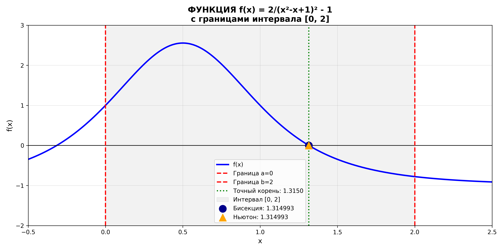
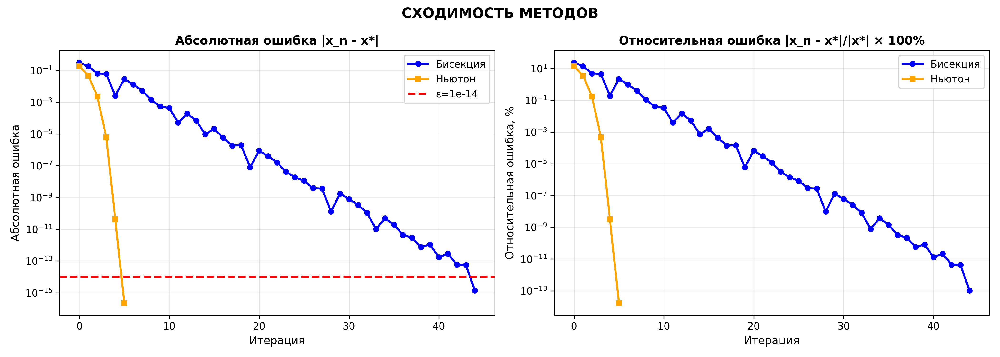
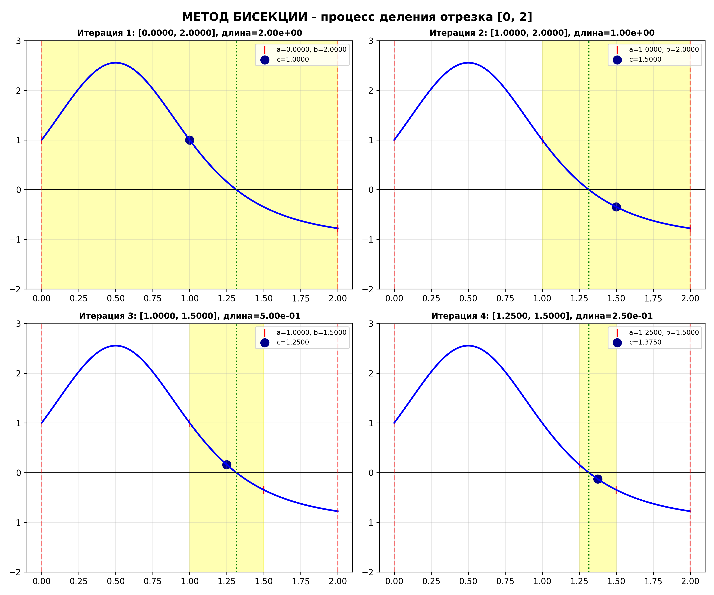

# 📉 Lab 05: Bisection and Newton Methods

[](https://www.python.org/)
[](https://numpy.org/)
[](https://matplotlib.org/)
[]()

Раздел лабораторной работы №5 по дисциплине **«Математическое компьютерное моделирование»**.

---

## Описание задачи

Найти приближённое значение корня функции двумя методами:

$$ f(x) = \frac{2}{(x^2 - x + 1)^2} - 1 $$

Используем:

- метод бисекции на отрезке $[0; 2]$;
- метод касательных (метод Ньютона) с начальным приближением $x_0 = 1.5$.

Условия останова:

- `N_MAX = 10^6` — максимальное количество итераций;
- `ε = 10^-14` — требуемая точность.

Точный корень на заданном отрезке:

$$ x^* = \frac{1 + \sqrt{4\sqrt{2} - 3}}{2} \approx 1.314992983020771 $$

---

## Примеры результатов

| Общий график | Сходимость методов |
|:------------:|:------------------:|
|  |  |

| Метод бисекции | Метод Ньютона |
|:--------------:|:-------------:|
|  |  |

---

## Методы

### Метод бисекции

На каждой итерации отрезок делится пополам. Для следующей итерации выбирается
та половина, на концах которой функция сохраняет разные знаки:

$$ c_n = \frac{a_n + b_n}{2} $$

### Метод касательных (метод Ньютона)

Следующее приближение строится через касательную к графику функции:

$$ x_{n+1} = x_n - \frac{f(x_n)}{f'(x_n)} $$

---

## Возможности

| Функция | Описание |
|---------|----------|
| Параметризация | Все настройки в `config.py` |
| Сравнение методов | Бисекция и метод Ньютона запускаются для одной функции |
| Оценка ошибок | Абсолютная, относительная погрешность и невязка `\|f(x)\|` |
| Визуализация | Общий график, первые итерации и сравнение сходимости |
| Экспорт графиков | PNG + SVG в папку `plots/` |

---

## Технологии

| Компонент | Версия | Назначение |
|-----------|--------|------------|
| Python | 3.9+ | Основной язык |
| NumPy | 2.0.2 | Численные расчёты |
| Matplotlib | 3.9.4 | Построение графиков |

---

## Запуск

# 1. Активировать виртуальное окружение (из корня проекта)
```
source .venv/bin/activate
```

# 2. Перейти в папку лабы
```
cd lab-05-equation-solving-methods/bisection-newton
```

# 3. Запустить скрипт
```
python3 bisection_newton.py
```

---

## После запуска:
1. Выведет точный и найденные корни, погрешности и причины остановки
2. Создаст папку `plots/` (если её нет)
3. Сохранит четыре набора графиков в форматах PNG и SVG

---

## Конфигурация
Все параметры в `config.py`:

|Параметр|Описание|
|---|---|
|`A`, `B`|Границы отрезка для метода бисекции|
|`X0`|Начальное приближение для метода Ньютона|
|`EPSILON`|Точность останова|
|`N_MAX`|Максимальное количество итераций|
|`DERIVATIVE_MIN_ABS`|Порог защиты от деления на слишком малую производную|
|`CURVE_SAMPLES`|Количество точек для гладкого графика функции|
|`MAX_ITERATIONS_SHOW`|Сколько первых итераций показывать на графиках|
|`SAVE_UNIQUE_NAMES`|Защита от перезаписи файлов|
|`SHOW_PLOT`|Показывать окна с графиками|

---

## Структура папки
```
lab-05-equation-solving-methods/bisection-newton/
├── config.py                 # Конфигурация задачи
├── bisection_newton.py       # Основной скрипт
├── README.md                 # Этот файл
├── examples/                 # Примеры графиков для README
│   ├── overview.png
│   ├── bisection.png
│   ├── newton.png
│   ├── convergence.png
│   └── legacy/               # Предыдущие варианты графиков
└── plots/                    # Авто-генерация PNG/SVG
```
<div align="center">

[⬆️ Наверх](#-Lab-05-Bisection-and-Newton-Methods)

</div>
