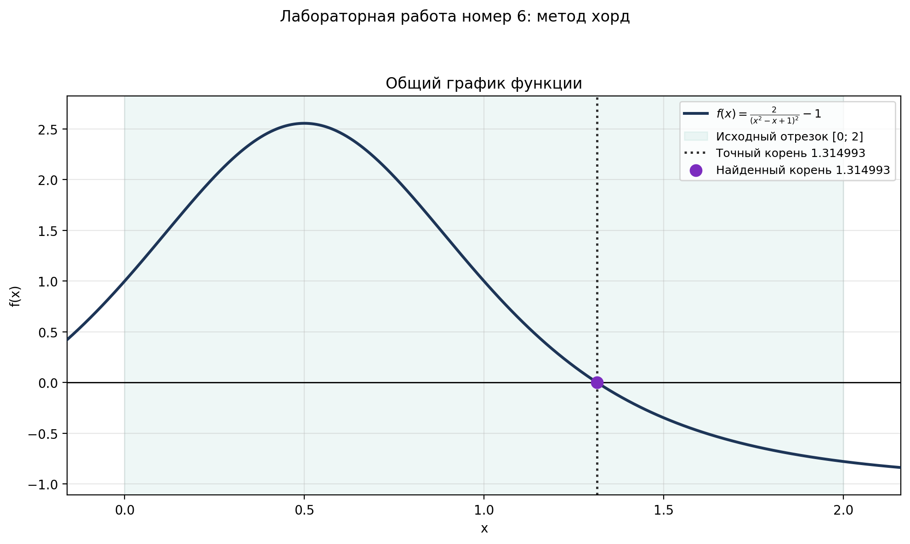
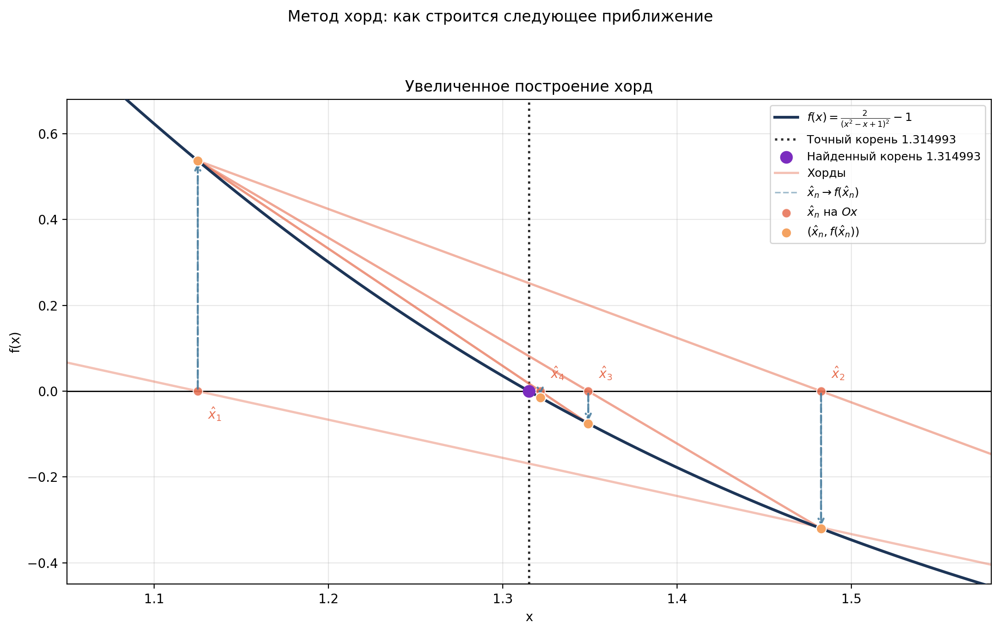

# 📈 Lab 05: Chord Method

[](https://www.python.org/)
[](https://numpy.org/)
[](https://matplotlib.org/)
[]()

Раздел лабораторной работы №5 по дисциплине **«Математическое компьютерное моделирование»**.

---

## Описание задачи

Найти приближённое значение корня функции методом хорд:

$$ f(x) = \frac{2}{(x^2 - x + 1)^2} - 1 $$

на отрезке:

$$ x \in [0; 2] $$

Условия останова:

- `N_MAX = 10^6` — максимальное количество итераций
- `Δx < ε`, где `ε = 10^-14`

Точный корень на заданном отрезке:

$$ x^* = \frac{1 + \sqrt{4\sqrt{2} - 3}}{2} \approx 1.314992983020771 $$

---

## Пример результата

| Общий график | Увеличенное построение хорд |
|:------------:|:---------------------------:|
|  |  |

---

## Метод

На каждой итерации строится хорда через точки `(a, f(a))` и `(b, f(b))`.
Точка пересечения хорды с осью `Ox` берётся как новое приближение:

$$ x_n = a - \frac{f(a)(b-a)}{f(b)-f(a)} $$

После этого значение `x_n` переносится на график функции: из точки `(x_n, 0)`
строится вертикаль к `(x_n, f(x_n))`. Эта точка становится одним из концов
следующей хорды, а второй конец берётся с противоположной стороны отрезка,
где сохраняется смена знака функции.

---

## Возможности

| Функция | Описание |
|---------|----------|
| Параметризация | Все настройки в `config.py` |
| Метод хорд | Поиск корня с сохранением истории итераций |
| Условия останова | Контроль `N_MAX` и `Δx < ε` |
| Оценка ошибок | Сравнение с точным корнем варианта |
| Визуализация | Отдельный общий график и отдельный увеличенный график построения хорд |
| Экспорт графиков | PNG + SVG в папку `plots/` |

---

## Технологии

| Компонент | Версия | Назначение |
|-----------|--------|------------|
| Python | 3.9+ | Основной язык |
| NumPy | 2.0.2 | Численные расчёты |
| Matplotlib | 3.9.4 | Построение графиков |

---

## Запуск

# 1. Активировать виртуальное окружение (из корня проекта)
```
source .venv/bin/activate
```

# 2. Перейти в папку лабы
```
cd lab-05-equation-solving-methods/chord-method
```

# 3. Запустить скрипт
```
python3 chord_method.py
```

---

## После запуска:
1. Выведет найденный корень и точный корень
2. Покажет ошибку, значение `f(x_hat)`, количество итераций и причину остановки
3. Создаст папку `plots/` (если нет)
4. Сохранит два графика: общий вид функции и увеличенное построение хорд

SVG-файлы из папки `plots/` удобно открывать в браузере: их можно приближать
без потери качества.

---

## Конфигурация
Все параметры в `config.py`:

|Параметр|Описание|
|---|---|
|`A`, `B`|Границы отрезка поиска корня|
|`EPSILON`|Точность останова по `Δx`|
|`N_MAX`|Максимальное количество итераций|
|`CURVE_SAMPLES`|Количество точек для гладкого графика функции|
|`MAX_CHORDS_SHOW`|Сколько первых хорд показывать на графике|
|`OVERVIEW_FIGURE_SIZE`, `ZOOM_FIGURE_SIZE`|Размеры общего и увеличенного графиков|
|`SAVE_UNIQUE_NAMES`|Защита от перезаписи файлов|
|`SHOW_PLOT`|Показывать окно с графиком|

---

## Структура папки
```
lab-05-equation-solving-methods/chord-method/
├── config.py                 # Конфигурация задачи
├── chord_method.py           # Основной скрипт
├── README.md                 # Этот файл
├── examples/                 # Для README
│   ├── overview.png          # Общий график функции
│   └── zoom.png              # Увеличенное построение хорд
└── plots/                    # Графики
```
<div align="center">

[⬆️ Наверх](#-Lab-05-Chord-Method)

</div>
