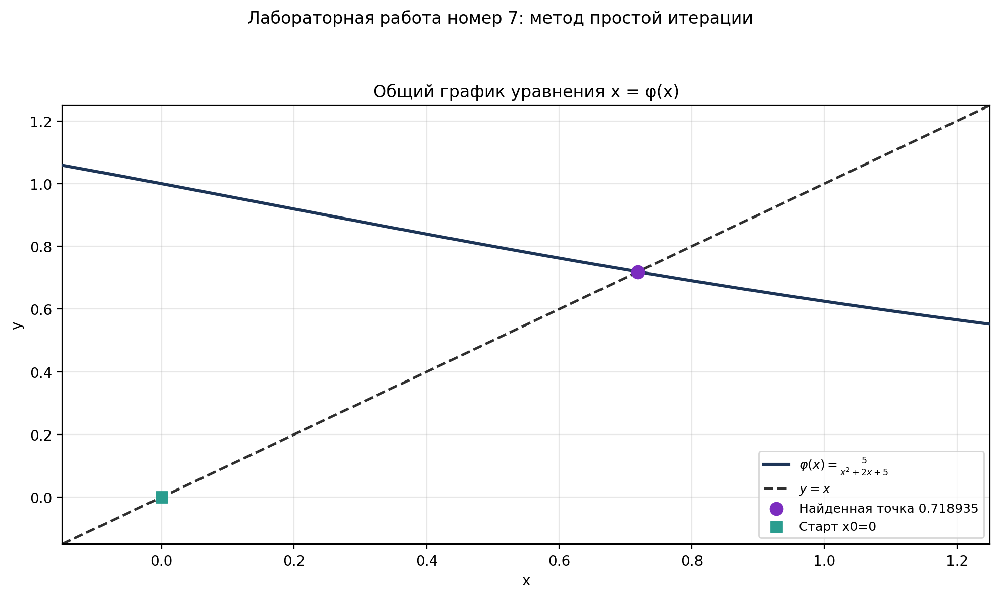
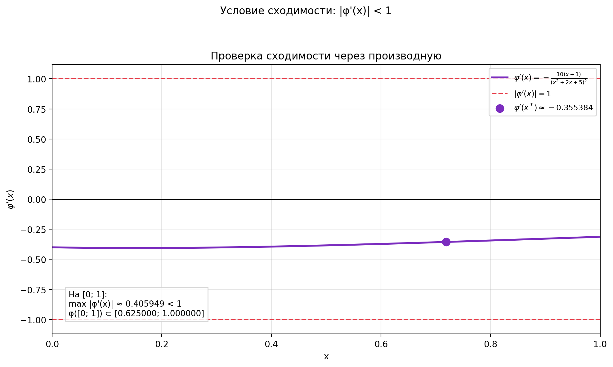

# 🔁 Lab 05: Fixed-Point Iteration

[](https://www.python.org/)
[](https://numpy.org/)
[](https://matplotlib.org/)
[]()

Раздел лабораторной работы №5 по дисциплине **«Математическое компьютерное моделирование»**.

---

## Описание задачи

Найти приближённое значение неподвижной точки методом простой итерации:

$$ x = \varphi(x) $$

где:

$$ \varphi(x) = \frac{5}{x^2 + 2x + 5} $$

Итерационная формула:

$$ x_{n+1} = \varphi(x_n) $$

Для проверки сходимости используется производная:

$$ \varphi'(x) = -\frac{10(x+1)}{(x^2 + 2x + 5)^2} $$

На интервале проверки `[0; 1]`:

$$ \max|\varphi'(x)| \approx 0.4 < 1 $$

Значит, простая итерация является сжимающим отображением на выбранном
интервале, и последовательность сходится к неподвижной точке.

Условия останова:

- `N_MAX = 10^6` — максимальное количество итераций
- `Δx < ε`, где `ε = 10^-14`

По умолчанию используется стартовое приближение:

$$ x_0 = 0 $$

Контрольный корень получается из уравнения:

$$ x^3 + 2x^2 + 5x - 5 = 0 $$

$$ x^* \approx 0.718934551345727 $$

---

## Пример результата

| Общий график | Производная | Улитка простой итерации |
|:------------:|:------------:|:-----------------------:|
|  |  |  |

---

## Метод

На графике строятся две кривые:

- `y = φ(x)`
- `y = x`

Улитка показывает движение итераций:

1. Из точки `x_n` делаем вертикальный шаг к графику `y = φ(x)`.
2. Получаем значение `x_{n+1} = φ(x_n)`.
3. Горизонтальным шагом переносим это значение на диагональ `y = x`.
4. Повторяем процесс, пока `Δx = |x_{n+1} - x_n| < ε`.

---

## Возможности

| Функция | Описание |
|---------|----------|
| Параметризация | Все настройки в `config.py` |
| Метод простой итерации | Расчёт `x_{n+1}=φ(x_n)` |
| Проверка сходимости | Формула `φ'(x)` и контроль `max |φ'(x)| < 1` |
| Условия останова | Контроль `N_MAX` и `Δx < ε` |
| Оценка ошибок | Сравнение с контрольным корнем |
| Визуализация | Общий график и отдельная улитка |
| Интерактив | HTML-улитка с приближением колесом мыши |
| Экспорт графиков | PNG + SVG в папку `plots/` |

---

## Технологии

| Компонент | Версия | Назначение |
|-----------|--------|------------|
| Python | 3.9+ | Основной язык |
| NumPy | 2.0.2 | Численные расчёты |
| Matplotlib | 3.9.4 | Построение графиков |
| HTML Canvas | — | Интерактивная улитка без дополнительных зависимостей |

---

## Запуск

# 1. Активировать виртуальное окружение (из корня проекта)
```
source .venv/bin/activate
```

# 2. Перейти в папку лабы
```
cd lab-05-equation-solving-methods/fixed-point-iteration
```

# 3. Запустить скрипт
```
python3 fixed_point_iteration.py
```

---

## После запуска:
1. Выведет найденную неподвижную точку и контрольный корень
2. Покажет производную, ошибку, невязку, количество итераций и причину остановки
3. Создаст папку `plots/` (если нет)
4. Сохранит общий график, график производной и график-улитку в PNG/SVG
5. Сохранит `fixed_point_cobweb_interactive.html` для приближения колесом мыши

SVG-файлы можно приближать в браузере без потери качества.
HTML-файл поддерживает приближение колесом мыши и перемещение зажатой кнопкой.

---

## Конфигурация
Все параметры в `config.py`:

|Параметр|Описание|
|---|---|
|`X0`|Начальное приближение|
|`EPSILON`|Точность останова по `Δx`|
|`N_MAX`|Максимальное количество итераций|
|`CURVE_SAMPLES`|Количество точек для гладких кривых|
|`CHECK_X_MIN`, `CHECK_X_MAX`|Интервал проверки условия `max |φ'(x)| < 1`|
|`COBWEB_STEPS_SHOW`|Сколько шагов улитки показывать на PNG/SVG|
|`INTERACTIVE_STEPS_SHOW`|Сколько шагов показывать в HTML-улитке|
|`OVERVIEW_FIGURE_SIZE`, `DERIVATIVE_FIGURE_SIZE`, `COBWEB_FIGURE_SIZE`|Размеры графиков|
|`SAVE_UNIQUE_NAMES`|Защита от перезаписи файлов|
|`SHOW_PLOT`|Показывать окно с графиком|

---

## Структура папки
```
lab-05-equation-solving-methods/fixed-point-iteration/
├── config.py                 # Конфигурация задачи
├── fixed_point_iteration.py  # Основной скрипт
├── README.md                 # Этот файл
├── examples/                 # Для README
│   ├── overview.png          # Общий график
│   ├── derivative.png        # Проверка сходимости через производную
│   └── cobweb.png            # Улитка простой итерации
└── plots/                    # Графики и interactive HTML
```
<div align="center">

[⬆️ Наверх](#-Lab-05-Fixed-Point-Iteration)

</div>
