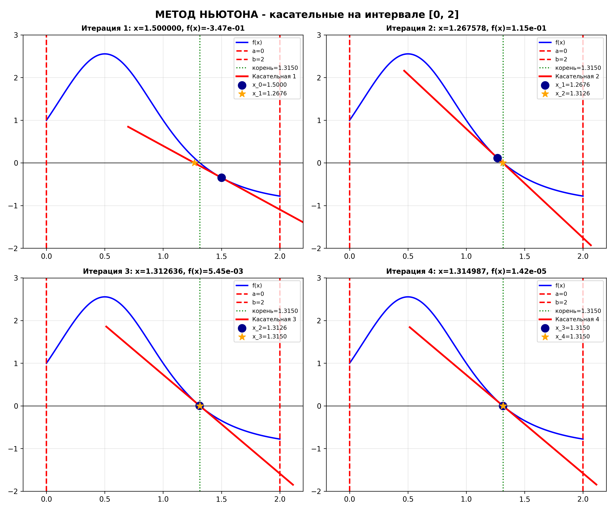

# Lab 05: Методы бисекции и касательных

## Постановка задачи

Требуется найти приближённый корень уравнения:

$$
f(x) = 0
$$

двумя методами:

1. Метод бисекции.
2. Метод касательных (метод Ньютона).

Для варианта по умолчанию:

$$
f(x) = \frac{2}{(x^2-x+1)^2} - 1
$$

$$
x \in [0; 2], \qquad x_0 = 1.5
$$

## Теория

### Метод бисекции

Если на концах отрезка функция имеет разные знаки, отрезок последовательно
делится пополам:

$$
c_n = \frac{a_n + b_n}{2}
$$

Для следующей итерации выбирается половина, на концах которой сохраняется
смена знака функции.

### Метод касательных

Следующее приближение вычисляется по формуле Ньютона:

$$
x_{n+1} = x_n - \frac{f(x_n)}{f'(x_n)}
$$

Метод касательных обычно сходится быстрее бисекции, но требует корректного
начального приближения и ненулевой производной.

## Настройка варианта

Параметры находятся в `config.py`.

| Параметр | Назначение |
|----------|------------|
| `FUNCTION_FORMULA` | Функция `f(x)` |
| `DERIVATIVE_FORMULA` | Производная `f'(x)` |
| `A`, `B` | Отрезок поиска корня |
| `X0` | Начальное приближение метода касательных |
| `EPSILON`, `N_MAX` | Критерии останова |
| `REFERENCE_ROOT` | Контрольный корень (`None` для автоматического поиска) |

Поддерживаются: `x`, `+`, `-`, `*`, `/`, `^`, скобки, `sin`, `cos`, `tan`,
`exp`, `log`, `sqrt`, `abs`, `pi`, `e`.

## Примеры результатов

| Общий график | Сходимость методов |
|:------------:|:------------------:|
|  |  |

| Метод бисекции | Метод касательных |
|:--------------:|:-----------------:|
|  |  |

## Вывод

Бисекция обеспечивает устойчивое сужение отрезка при наличии смены знака.
Метод касательных при удачном начальном приближении достигает той же точности
за существенно меньшее число итераций.
