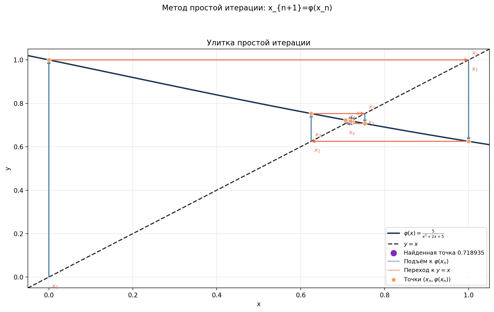

# Lab 06: Метод простых итераций

## Постановка задачи

Требуется найти неподвижную точку уравнения:

$$
x = \varphi(x)
$$

Для варианта по умолчанию:

$$
\varphi(x) = \frac{5}{x^2 + 2x + 5}
$$

$$
x_0 = 0
$$

## Теория

Последовательность приближений строится по формуле:

$$
x_{n+1} = \varphi(x_n)
$$

Достаточное условие сходимости на выбранном интервале:

$$
\max |\varphi'(x)| < 1
$$

Для варианта по умолчанию:

$$
\varphi'(x) =
-\frac{10(x+1)}{(x^2 + 2x + 5)^2}
$$

График-улитка показывает вертикальные переходы к `y = phi(x)` и
горизонтальные переходы к диагонали `y = x`.

## Настройка варианта

Локальные параметры находятся в `config.py`.

| Параметр | Назначение |
|----------|------------|
| `PHI_FORMULA` | Функция `phi(x)` |
| `PHI_DERIVATIVE_FORMULA` | Производная `phi'(x)` |
| `X0` | Начальное приближение |
| `CONTROL_A`, `CONTROL_B` | Отрезок поиска контрольного корня |
| `CHECK_X_MIN`, `CHECK_X_MAX` | Интервал проверки условия сжатия |

Критерии останова `EPSILON` и `N_MAX` берутся из
[конфигурации лабораторной №5](../../lab-05-root-finding-methods/config.py).

Поддерживаются: `x`, `+`, `-`, `*`, `/`, `^`, скобки, `sin`, `cos`, `tan`,
`exp`, `log`, `sqrt`, `abs`, `pi`, `e`.

## Пример результата

| Общий график | Производная | График-улитка |
|:------------:|:------------:|:-------------:|
|  |  |  |

## Вывод

Метод простых итераций прост в реализации, но требует удачного преобразования
уравнения к виду `x = phi(x)`. При выполнении условия сжатия последовательность
приближений сходится к единственной неподвижной точке.
